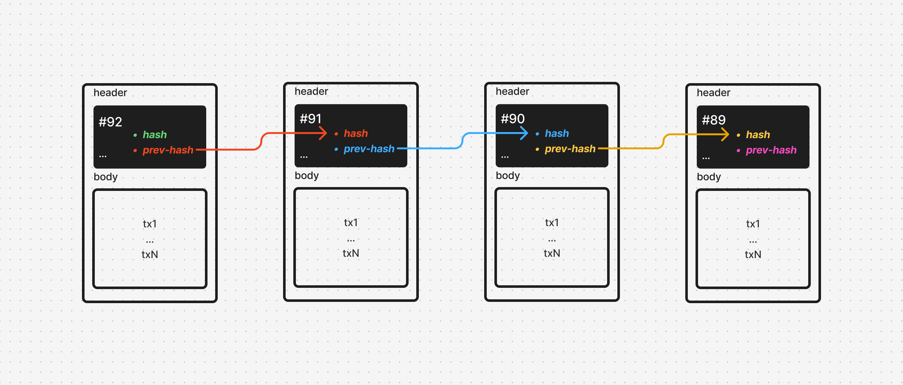

# **Aula 1: Introdução à Web3**

- data: 28/04
- prof: Lucas Oliveira

## **1. Abertura**

**Hello World!**

Sejam todos bem-vindos ao GRANDE CÓDIGO.

Bootcamp/Hackathon/Incubação da NearX

Sua porta de entrada para o ecossistema blockchain/web3 e provas ZK.

Hoje vou te apresentar como vai funcionar o evento

---

## **2. Programação**

1. **Apresentação**: Quem somos
2. **Jornada do Bootcamp/Hackathon**: Cronograma & Estudos
3. **Web3 na Prática**: Blockchain, Smart Contracts e ZK Proofs
   - **Demo:** DApp Earth's Central Bank
   - **Teoria:** Carteiras, Transações, Blocos, Consenso
   - **Smart Contracts:** EVM/Solidity vs. Não-EVM (WASM/Rust)
   - **Provas ZK:** Conceitos e ZkVerify

> **Dica:** QR code para o Discord.

---

## **3. Apresentação**

### **Lucas Oliveira**

- **Head of Education @ NearX**: Liderança em educação blockchain na LATAM.
- **+5 anos como Engenheiro de Blockchain**:
  - Criação de Layer 1, SDKs, smart contracts (EVM e não-EVM).
- **Embaixador da Stellar no Brasil**.
- **Contribuidor F/OSS**: +3 bibliotecas crypto publicadas.
- **Matemático** (formado em 2021).

---

### **NearX**

- Plataforma de educação em tecnologias emergentes (Web3, IA, Blockchain).
- **+2.500 membros** no Discord.
- Oferece: Pós-graduação, Plataforma por assinatura, Mentorias, Bootcamps, Hackathons
- **Parcerias**: Animoca Brands, Stellar, Optimism, Arbitrum, Starknet, ZkVerify, MultiverseX.

---

### **ZkVerify**

- Projeto focado em **Zero-Knowledge Proofs** (ZKPs).
- Casos de uso:
  - Verificação de identidade sem expor dados pessoais.
  - Transações privadas em blockchain.
  - Integração com DeFi e DAOs.

> **Slide:** Mostre arquitetura ZkVerify + link para documentação.

---

## **4. Jornada do Bootcamp**

### **Semana 1 (Fundamentos Web3):**

- **28/04**: Introdução à Web3 (esta aula).
- **29/04**: Solidity Básico → Primeiro token ERC-20.
- **30/04**: JavaScript & Web3 → Conexão com MetaMask.
- **01/05**: Solidity Avançado → Tokenização de ativos.
- **02/05**: Projeto FullStack 1 → Integração frontend + contrato.

---

### **Semana 2 (Imersão ZK):**

- **03/05**: Criptografia → Base para ZK Proofs.
- **04/05**: Arquitetura ZkVerify → Integração no projeto.
- **05/05**: Linguagens (Rust) e Frameworks (Substrate).
- **06/05**: Casos de uso ZK → Aplicações reais.
- **07/05**: Projeto FullStack 2 → MVP para o hackathon.

---

### **Semana 3 (Mentorias/Hackathon):**

- **12/05**: Validação de ideias e design.
- **13/05**: Roadmap de projeto.
- **14/05**: Desenvolvimento do MVP.
- **15/05**: Modelos de negócio.
- **16/05**: Pitch final.

---

## **5. Web3 na Prática**

### **Demo Rápida**

- **DApp Earth's Central Bank**

---

## **6. Web3 na Teoria**

### **Fundamentos**

- **Carteiras (Wallets)**
- **Transações**
- **Blocos**
- **Consenso**

---

### Carteiras (Wallets)

---

### Transações

---

### Blocos

---

### Consenso

---

## **7. Smart Contracts**

- **EVM/Solidity**
- **Não-EVM (WASM/Rust)**

---

### EVM/Solidity

---

### Não-EVM (WASM/Rust)

---

## **8. Provas ZK**

- **Conceitos**: Privacidade + escalabilidade.
- **ZkVerify**: Verificador de provas.

---

## **9. Recapitulação:**

1. **Apresentação**: Quem somos!
2. **Jornada do Bootcamp/Hackathon**: Cronograma.
3. **Web3 na Prática**: Blockchain, Smart Contracts e Provas ZK.

---

## **10. Lição de Casa**

### Desafio de Aprendizagem

1. Instalar Foundry
2. Ler docs [Solidity](https://docs.soliditylang.org)
3. Ler docs [ZkVerify](https://github.com/zkverify/docs)

### Desafio de Carreira

4. Post no Linkedin #zknearx (1/10)

### Desafio de Comunidade

5. 🖥️ Poste uma foto da sua mesa de trabalho! (discord)

---

## **11. Próxima Aula**

**29/04 – Introdução ao Solidity**

- Vamos escrever nosso primeiro smart contract (token erc20).

_"Não esqueça: Aula ao vivo amanhã, 19h, no YouTube. Traga suas dúvidas!"_
